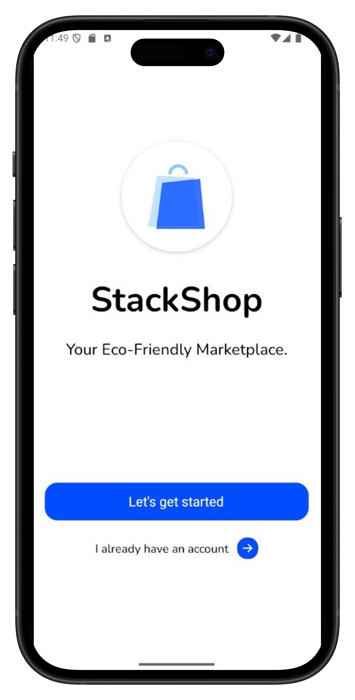
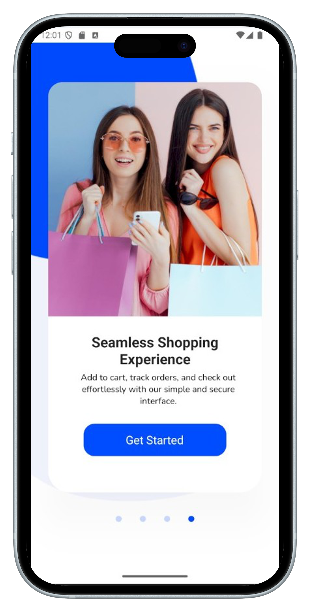
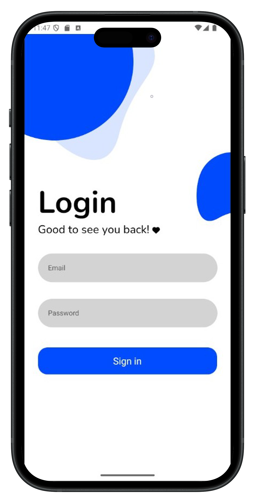
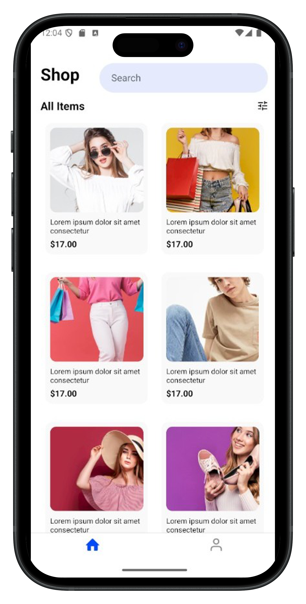
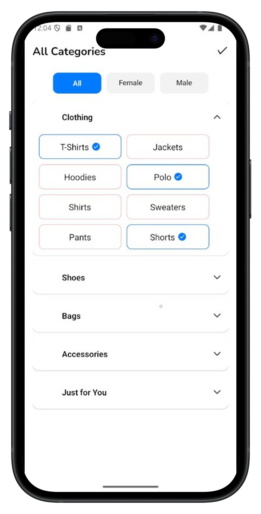
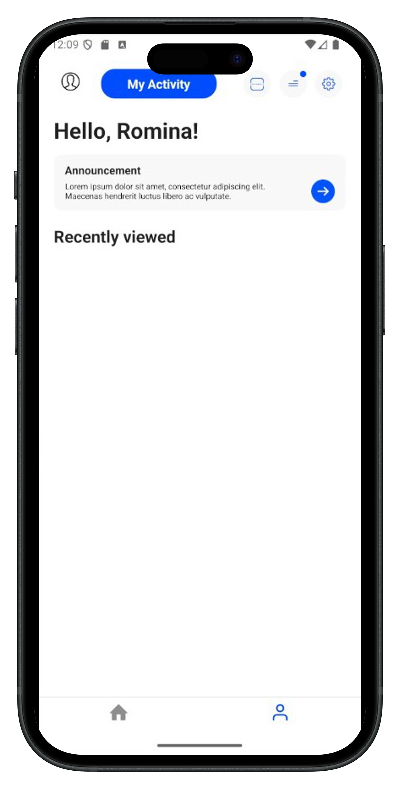

# 🛍️ Stack Shop (In Progress)

> 📱 *A modern e-commerce mobile app built with React Native and Expo.*  
> 🚧 This project is currently under active development and will be updated regularly.

---

## 📌 Project Overview

**Stack Shop** is a mobile-first e-commerce application built using React Native. The app aims to deliver a smooth and visually appealing shopping experience, with core features like product browsing, cart management, and onboarding screens. It is part of my personal portfolio and is currently a **work in progress**.

---

## 🚧 Current Status

✅ Initial app setup  
✅ Onboarding screens  
✅ Product listing UI with mock data  
✅ Cart screen UI (basic state handling)
✅ Authentication with Firebase (Redux)  
🔜 Product detail screen  
🔜 API or Firebase integration (Other pages)
🔜 Add to Cart  
🔜 Checkout and authentication

---

## ⚙️ Tech Stack

- **Framework**: React Native + Expo
- **Navigation**: React Navigation
- **State Management**: Redux
- **Icons**: React Native Expo Vector Icons

---

## 📸 Screenshots

### Onboarding Screen

### Login

### Main App

### Profile (In Progress)

